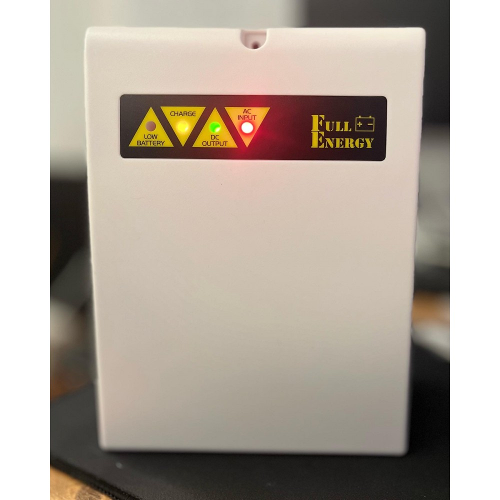
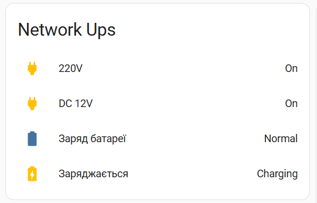
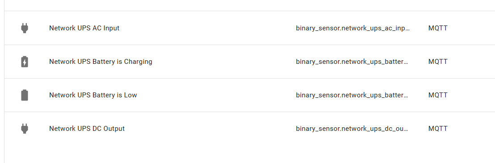
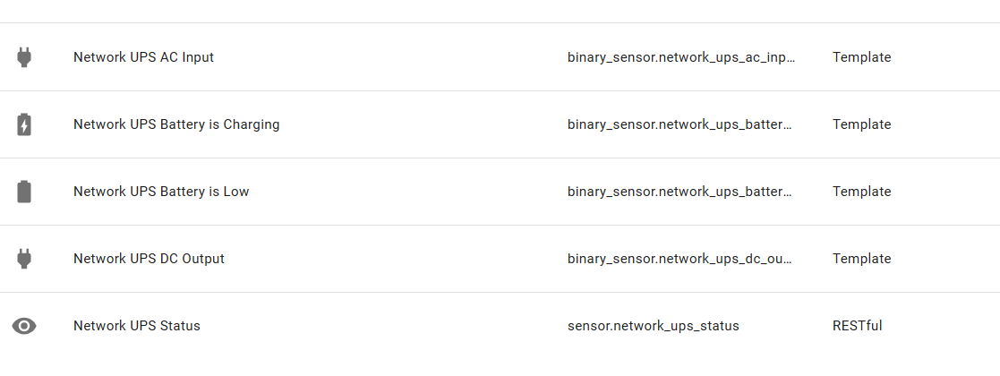

# Network UPS

## Description
This project aims to enhance the functionality of my network UPS system, making it smarter. Frequent electricity outages in Ukraine have highlighted the need to automate various processes that rely on electricity. Also, it helps to correct your plans in case of shit happened.

### How it works?
I have two UPS with front panels with 4 and 5 LED status indicators.
The idea is to replace the original pcb for these leds with a **ESP32-C3** microcontroller that will read statuses of these indicators.

Statuses:
- **AC Input**: Indicates whether mains electricity is available.
- **Battery is charging**: This is active when the battery is charging (e.g., when 12V is provided).
- **Battery is low**: Warns when the battery level is critically low.
- **DC output**: Always green.
- **AC Input is absent**: only at one of my UPS

### Functionality
This project have the following features:
1. **Real-time monitoring**
2. **Home Assistant integration**

The pcb is done in modifications with 4 and 5 leds

### Configs
See the `Variables` section in the code to understand how to configure your device for your specific setup. These configurations allow you to adapt the system to the type of UPS you are using, as well as customize notifications and automation.

### Home Assistant integration
You can integrate your UPS with Home Assistant in two ways:
- **API**: Enables direct communication with Home Assistant using RESTful APIs.
- **MQTT**: Allows integration via MQTT, a lightweight messaging protocol commonly used in IoT systems.

The provided code supports both integration methods. You can find detailed configuration files and examples in the `files` folder to help you set up and start using your smart UPS.

### Components you will need
1. **4-5 Leds**
2. **ESP32 C3**
3. **PH2.0 connectors (5/6 pins and 2 pins)**
4. **Diode 1N4148WS**
5. **100nF capacitor**
6. **PCB** - can be find in the files folder (POWER_LED.zip)

# Thanks
The PCB was designed by [Ivan](https://github.com/Ivan7123)